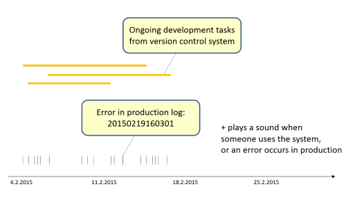

# mashup-tile
A Node.js back-end that mashes up information for a JavaScript front-end.

# Data Sources #

The data sources for the mashup are:

* Development Events from the Version Control System data (Mercurial)
* Usage Events from the Production logs of Lupapiste Application (http://lupapiste.fi) 
* Possibly Management Events from the issue management system (Jira)

# Draft of the mashup #

The user interface of the mashup consists timeline and data. The ongoing development tasks are shown as horizontal blocks. The production usage logs are shown as vertical lines. An error is drawn with red color. When an error occurs in production, a sound is played. Also, when someone uses the application in production, a sound is played.
